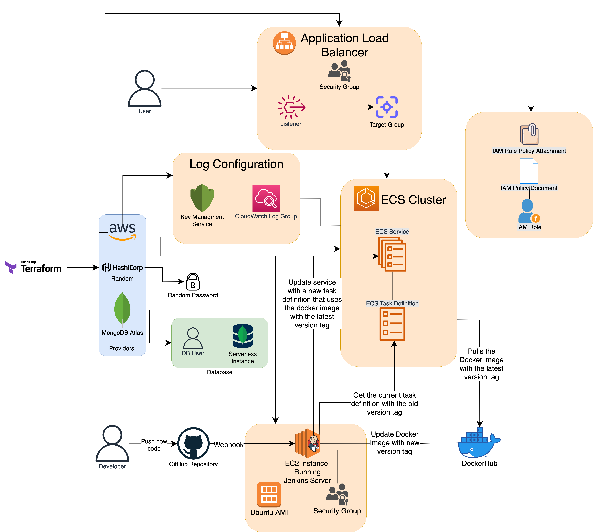

# Document Overview

This document will go through the details of the infrastructure that was used
for the deployment of this application, and why I made some of the decisions I
made in regards to the infrastructure tech stack.

The technologies used that are relevant to the deployment of this application
and building of this infrastructure are:

- Docker
- Terraform
- GitHub Webhooks
- AWS Elastic Compute Cloud (EC2)
- Jenkins
- DockerHub
- AWS Elastic Container Service (ECS)
- MongoDB Atlas

# Design Overview

This section will go through two designs:
- Design of the infrastructure (built by Terraform)
- Design for the CI/CD process

## The Infrastructure

*NOTE: This section will NOT explain why Terraform was used to build infrastructure. That decision is talked about [here]()*

# IaC/Infrastructure as Code (Terraform)

In order to build the infrastructure, I faced an option of either manually
creating the infrastructure using the GUI on AWS and MongoDB Atlas or use
Terraform. I elected for the latter since I had no prior experience with
Terraform (or IaC for that matter) and thought it would be a good devops skill
to pick up. Additionally, it would help me automate some of the process and
allow me a more grounded approach to learning AWS (which is also something
I had no prior experience with prior to this project)

Most of what is done with terraform in the infrastructure/ folder can be
understood through online documentations. The only important piece of
information is that all credentials/keys were accessed through the .env file
in the root directory of this project.

# The Database (MongoDB Atlas)

I concerned using an AWS service such as RDS or DynamoDB for my database
purposese. However, I quickly learned that these services were incompatible
with MongoDB which is what I was using as my database for the gsm application.
Then, I found out that the most popular solution for a database provider to use
in conjunction with AWS is MongoDB Atlas. I chose it because it was relatively
inexpensive and it seemed like the best option.

# ECS Fargate (AWS)

I used the ECS Fargate service because from my research, it was a solid service
for deploying docker containers. There was an alternative that might've been
better suited to my use case, specifically AWS Elastic Beanstalk. However, from
my research done, this service seemed fairly simplistic, and I wanted to get my
hands dirty with AWS, and learn as much as I could stomach through this project,
so I elected for ECS.

Choosing Fargate over deploying and manually provisioning EC2 instance was due
to the project needs. I was more interested in continuing app development over
the management tax that would have been added if I were to manually provision
EC2 instances. Furthermore, I did some research that suggested that for my use
case, the option of AWS Fargate would present with lower monthly costs due to
resources not being wasted.

# Attributions

## Logos

- [AWS Logo](https://en.wikipedia.org/wiki/File:Amazon_Web_Services_Logo.svg)
- [Hashicorp and Terraform Logos](https://www.hashicorp.com/brand)
- [MongoDB Atlas Logo](https://www.mongodb.com/brand-resources)
- [MongoDB Database Logo](https://www.opc-router.de/wp-content/uploads/2021/03/mongodb_thumbnail.png)
