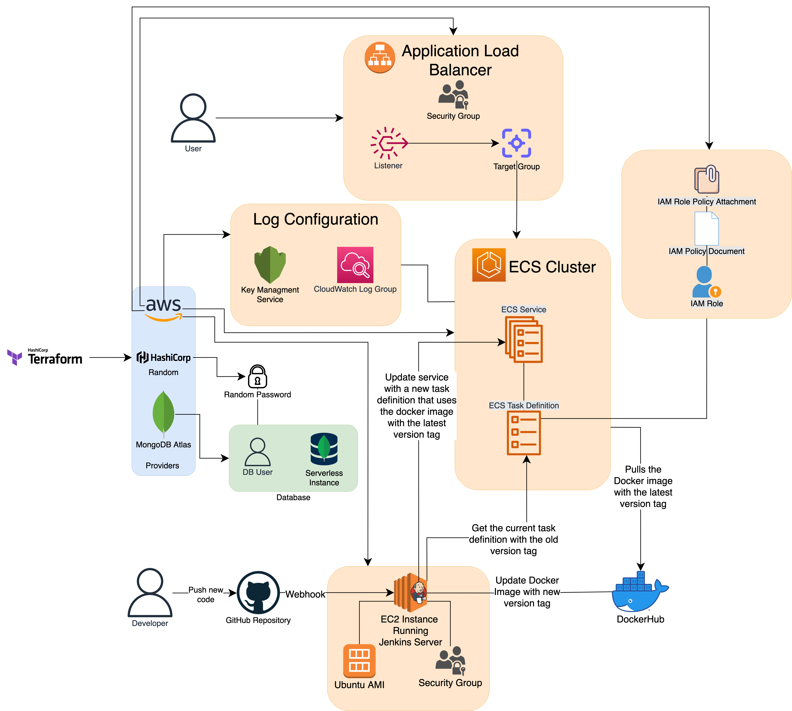
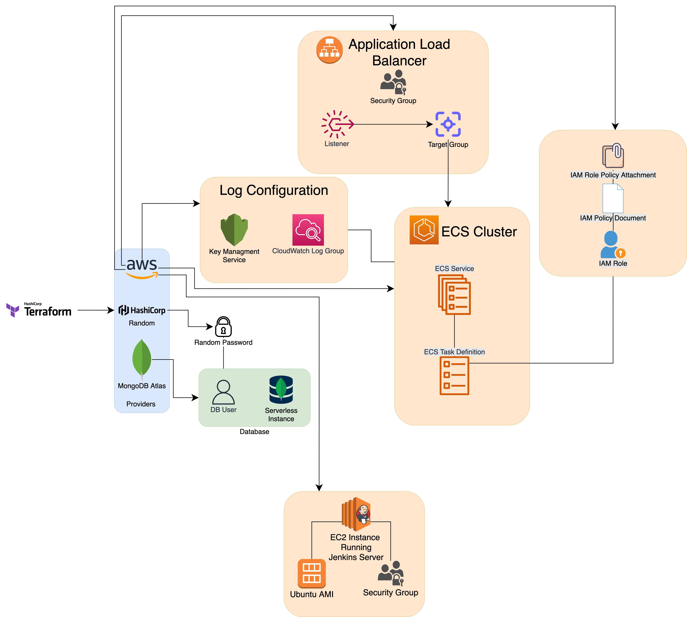
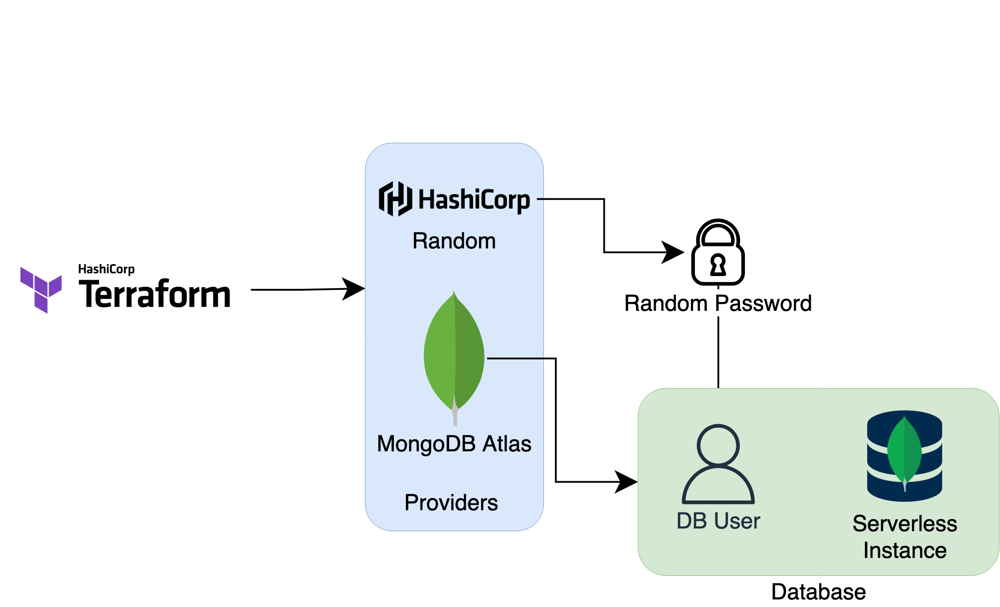
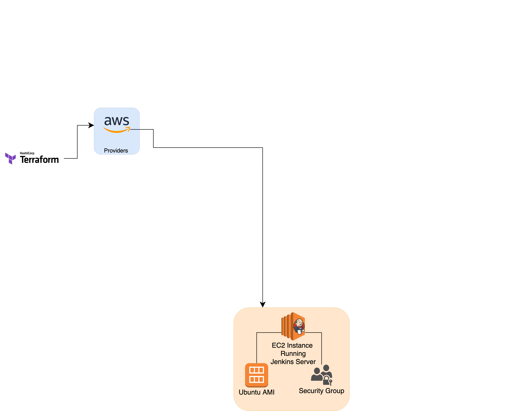
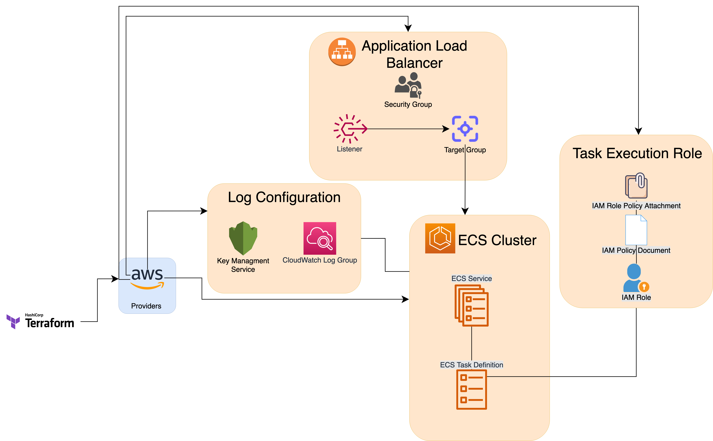
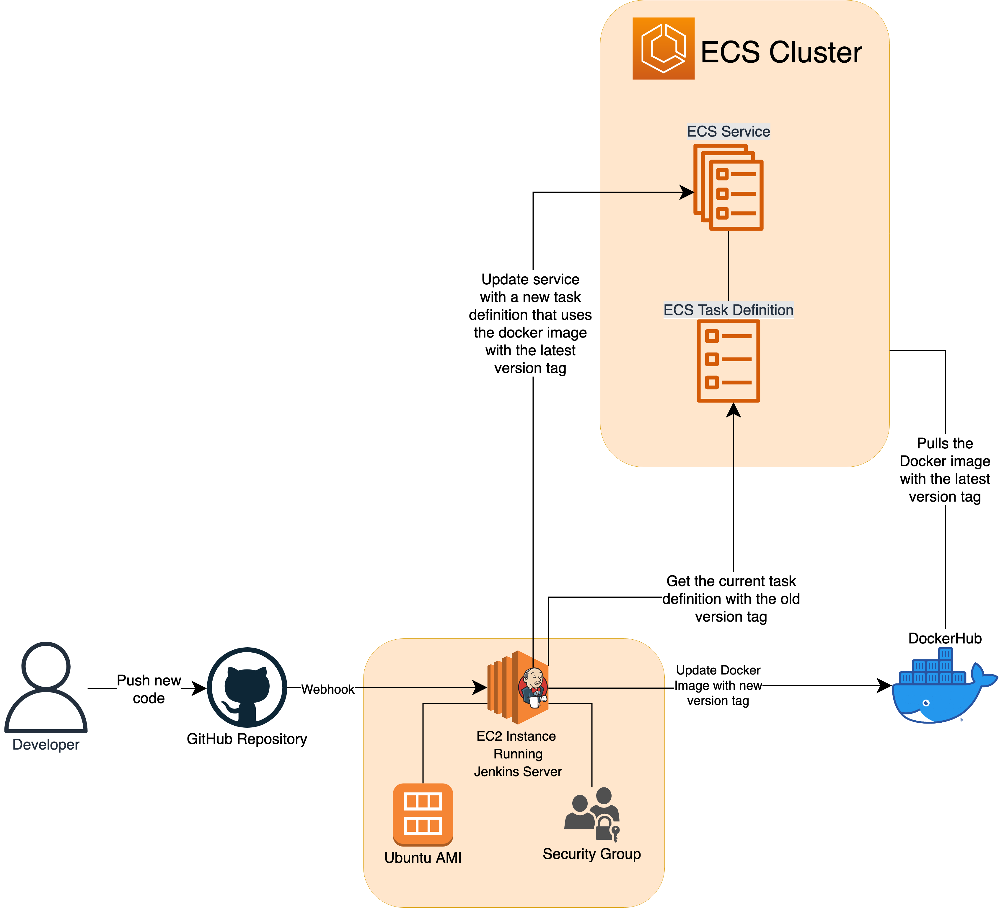

# Document Overview

This document will go through the design of the system.
It will cover how the system works on an infrastructure
level and why I made some of the design decisions that I
did.

The technologies used that are relevant to the deployment of this application
and building of this infrastructure are:

- Terraform
- GitHub Webhooks
- AWS Elastic Compute Cloud (EC2)
- Jenkins
- DockerHub
- AWS Elastic Container Service (ECS)
- MongoDB Atlas

# Design Overview

The following diagram shows the entire design of the
system.



[link to diagram for fullscreen view](https://github.com/AhmedNSidd/gamers-social-manager-telegram-bot/blob/main/docs/images/infrastructure_diagram.png)

This is a pretty meaty diagram though so we will dedicate
the rest of this document to breaking down this system
and talk about why some design decisions were made over
others.


# IaC/Infrastructure as Code (Terraform)

The best place to start to talk about how we built the
infrastructure. In order to build the infrastructure, 
I faced an option of either manually creating the 
infrastructure using the GUIs and navigating the websites
of AWS and MongoDB Atlas or use Terraform. I elected for 
the latter since I had no prior experience with
Terraform (or IaC for that matter) and thought it would 
be a good devops skill to pick up. Additionally, it would 
help me automate some of the process and allow me a more 
grounded approach to learning AWS (which is also something
I had no prior experience with prior to this project).

Let's go through a simplified version of the system
diagram to see what Terraform is doing.


[link to diagram for fullscreen view](https://github.com/AhmedNSidd/gamers-social-manager-telegram-bot/blob/main/docs/images/terraform_entire_system.png)

We start with Terraform (on the left side of the picture)
setting up multiple providers: The MongoDBAtlas,
Hashicorp's Random, and AWS

There are three main services that Terraform is creating:
- Database (using MongoDBAtlas and Hashicorp's Random)
- EC2 Instance running Jenkins Server (using AWS, for a CI/CD pipeline)
- Application Load Balancer + ECS cluster + Log Configuration + IAM Task Execution Role (this is to run
the actual frontend and backend of GSM)

## Database


[link to diagram for fullscreen view](https://github.com/AhmedNSidd/gamers-social-manager-telegram-bot/blob/main/docs/images/database.png)

Hashicorp's Random provider is only used to create a
random password that is used for the database user
for MongoDB Atlas's serverless instance. These 
credentials, along with the database url are then later 
passed into the container that is running the GSM bot.

**Why MongoDB Atlas?**

I considered using an AWS service such as RDS or DynamoDB 
for my database purposes. However, I quickly learned that 
these services were incompatible with MongoDB which is 
what I was using as my database for the GSM bot.
Then, I found out that the most popular solution for a 
database provider was MongoDB Atlas. Furthermore, I chose
it because it was relatively inexpensive.


## EC2 Instance running Jenkins Server


[link to diagram for fullscreen view](https://github.com/AhmedNSidd/gamers-social-manager-telegram-bot/blob/main/docs/images/ec2.png)


I created an EC2 instance that would allow me to run
Jenkins server that would serve as a CI/CD pipeline.
The idea was that as I push my code, this EC2 instance
would get notified and it would update the code on the
main server that is running my application.

Terraform also creates a Ubuntu AMI data source that is
fed to the EC2 instance on creation. This is so Ubuntu
is run on the EC2 instance.

Terraform also creates a security group, and this is
simply to allow access to the Jenkins server so that
an admin may be able to access it and provision the CI/CD
pipeline properly.

**Why EC2 and Jenkins?**

I picked these technologies simply because I wanted to
learn more about them. I knew I wanted a CI/CD pipeline
because it would make my development life easier.

In retrospect though, I think I'll eventually want to
use a cheaper alternative as running a whole EC2 instance
doesn't seem worth the price I will have to pay just for a
CI/CD pipeline. Though I'm glad I got to learn these
technologies.

## Application Load Balancer + ECS cluster + Log Configuration + IAM Task Execution Role

This entire part of the infrastructure is used to run GSM.


[link to diagram for fullscreen view](https://github.com/AhmedNSidd/gamers-social-manager-telegram-bot/blob/main/docs/images/terraform_gsm.png)

### **Application Load Balancer**

We start with the Application Load balancer that terraform
creates, along with a Security Group, listener, and a
target group. All of these things are essential for an
ECS instance to be accessed by the public. This is the
first piece of infrastructure that will be hit by a user.

### **ECS Cluster (Fargate)**


**Why ECS and Fargate?**
I used the ECS Fargate service because from my research, it was a solid service
for deploying docker containers. There was an alternative that might've been
better suited to my use case, specifically AWS Elastic Beanstalk. However, from
my research done, this service seemed fairly simplistic, and I wanted to get my
hands dirty with AWS, and learn as much as I could stomach through this project,
so I elected for ECS.

Choosing Fargate over deploying and manually provisioning EC2 instance was due
to the project needs. I was more interested in continuing app development over
the management tax that would have been added if I were to manually provision
EC2 instances. Furthermore, I did some research that suggested that for my use
case, the option of AWS Fargate would present with lower monthly costs due to
resources not being wasted.

### **Log Configuration**

AWS's Key Managment System (KMS) is used to encrypt all
logs that are store in CloudWatch. These logs come from
GSM running on ECS cluster.

### **Task Execution Role**

In order for the Task Definition to send logs to
CloudWatch from GSM, it needs the Task Execution Role.

Specifically it needs an IAM role, that has the attached
appropriate permissions, which is what the IAM Policy
Document & the IAM Role Policy Attachment are there for.

# The CI/CD Pipeline

```
NOTE: The eventual plan is to stop using the pipeline described below and to
instead replace it with GitHub actions as it will prove to be more
cost-effective in the long term
```

Now that we've gone through the infrastructure that was built using Terraform, we will go through the CI/CD
pipeline that is run through the EC2 Instance (running
Jenkins)


[link to diagram for fullscreen view](https://github.com/AhmedNSidd/gamers-social-manager-telegram-bot/blob/main/docs/images/ci-cd-pipeline.png)

## **Inital Setup**

The first thing I did was setup a personal access token
with repo access permissions that I would later use on my
EC2 Jenkins Server.

The second thing I did was setup a webhook from my GSM
repository to send a POST web request to the EC2 Jenkins
server everytime there was a push event or somebody did
something regarding a pull request. This way, everytime
there was an update to the main branch, Jenkins would
get a notification via GitHub webhooks and it would pull
the most recent code and start the CI/CD process.

I also had to set up credentials for AWS and DockerHub.
These came in hand later on during the CI/CD process as
you'll soon see.

## **EC2 Jenkins Server**

### **CI/CD Pipeline**

The flow of the CI/CD pipeline is well demonstrated in the
diagram above. Once a developer pushes code to the GitHub
repository, the GitHub repository (with a webhook already
setup when there is a push or interaction with a pull
request), sends a POST request to our EC2 Jenkins server.
The EC2 Jenkins server then does the following:

1. Builds the docker image
2. Login into DockerHub
3. Pushes the new docker image of GSM with a new version
tag
4. Updates the AWS infrastructure to use the docker image
with the new version tag
    - It does this by getting the current task definition
    with the old version tag
    - It uses that exact task definiton, but just updates
    the image version tag so that the task definiton uses
    the new image
    - Finally, it updates the Service in our ECS Cluster
    to use the new task definition


### **Credentials**
I had to enter credentials into the Jenkins Server for:
- GitHub -- this was the Personal Access Token we just setup on GitHub. This is so Jenkins server had access to
our repository so it could build the image later
- DockerHub -- this is so Jenkins could push the Docker
image that it builds to my personal DockerHub
- AWS -- This is so Jenkins could update the AWS
infrastructure (task definition and service) to use the
new docker image


# Conclusion

With that we are done with the system design for the
deployment of our application. We were able to cover:
- Building of the infrastructure using Terraform
- The CI/CD pipeline using Jenkins that allowed automated
deployment of new code


# Attributions

## Learning Resources

- [How to Create a CI/CD Pipeline With Jenkins, Containers, and Amazon ECS by 
Alfonso Valdes Carrales](https://betterprogramming.pub/how-to-create-a-ci-cd-pipeline-with-jenkins-containers-and-amazon-ecs-af4eaec75b8b)
- [How to Deploy a Dockerised Application on AWS ECS With Terraform](https://medium.com/avmconsulting-blog/how-to-deploy-a-dockerised-node-js-application-on-aws-ecs-with-terraform-3e6bceb48785)
- [aws ecs - how to update a task definition](https://github.com/aws/aws-cli/issues/3064)
- [Deploying Docker Containers on AWS ECS using AWS CLI by Prakhar Srivastav](https://docker-curriculum.com/#aws-elastic-container-service)
- [AWS APPLICATION LOAD BALANCER (ALB) AND ECS WITH FLASK APP](https://www.bogotobogo.com/DevOps/AWS/aws-ELB-ALB-Application-Load-Balancer-ECS.php)
- [Create and manage an AWS ECS cluster with Terraform](https://www.architect.io/blog/2021-03-30/create-and-manage-an-aws-ecs-cluster-with-terraform/)
- [How to Deploy an Application to AWS Fargate](https://levelup.gitconnected.com/how-to-deploy-an-application-to-aws-fargate-cd3cfaccc537)